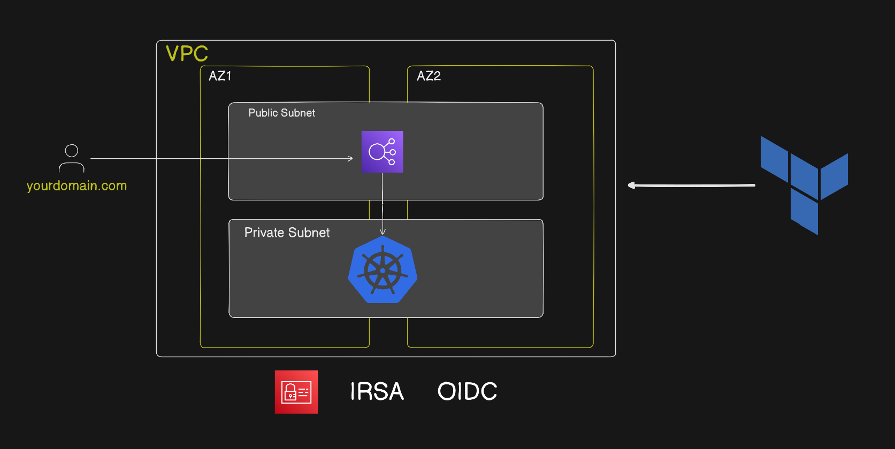
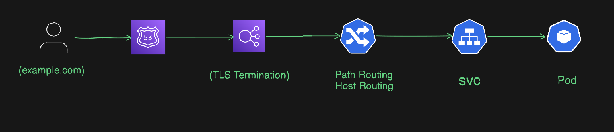

###    **Architecture Overview** 

This project implements a production-ready statefull (three-tier) application deployed on AWS using Kubernetes. The architecture is designed for scalability, resilience, and full automation using modern DevOps practices.
The system consists of:

- Frontend (React) – User-facing web application
- Backend (Node.js API) – Handles business logic and API requests
- Database (MongoDB) – Persistent data storage
## All application components(frontend and backend) are containerized using Docker and deployed on Amazon EKS (Elastic Kubernetes Service).

###   **User Access Flow** 
- User opens:
    https://vanya7.com
    Route 53 resolves domain → AWS ALB (Ingress Controller)    
- TLS termination using ACM
- Ingress (EKS) routes traffic to:
    React frontend service
    Node.js backend service (via /api)
- React app loads in browser and calls backend APIs like:
    https://vanya7.com/api
    Backend (Node.js on EKS) processes requests and talks to MongoDB
- Response flows back:
##  MongoDB → Backend → Ingress → ALB → Browser → UI updates


###  **Core Architecture Components**
The application is containerized using Docker and deployed on a managed Kubernetes cluster (AWS EKS). Infrastructure is provisioned with Terraform, while deployments are managed through a GitOps workflow using ArgoCD. The platform is designed for scalability, resilience, and continuous delivery.


- **Continuous Integration Continuous Delivery(CI/CD):**
A CI pipeline GitHub Actions is automatically triggered on each commit, The pipeline performs:
Application build (React frontend and Node.js backend), testing and validation Docker image creation for each service, Image tagging using versioning, Build Docker images are pushed to DockerHub, then updates Helm charts A GitOps tool (like Argo CD) deploys the changes automatically to EKS. DockerHub username and Token were stored in the secret and variable of Github
These images are immutable and used as deployment artifacts across environments.

- **Infrastructure as Code (Terraform)**
Terraform is used to provision AWS resources, including the EKS cluster, networking (VPC, subnets, nat_gatway Route Tables, Security Groups), and node groups. The configuration leverages reusable modules and includes cluster autoscaling.





- **Containerization & Registry (Docker & DockerHub)**
Each service (React frontend, Node.js backend, MongoDB) is containerized using Docker. Images are stored in DockerHub and versioned for traceability.

- **Container Orchestration (AWS EKS)**
Kubernetes (EKS) manages application deployment, scaling, and service discovery. Workloads are deployed as pods and exposed via services and ingress.

- **Package Management (Helm)**
Helm charts are used to define and manage Kubernetes resources for each application component, enabling consistent and repeatable deployments.

- **GitOps Deployment (ArgoCD)**
ArgoCD continuously monitors the Git repository and ensures that the cluster state matches the declared configuration. Any changes pushed to Git are automatically synchronized to the cluster.

- **Auto Scaling (Cluster Autoscaler)**
The Kubernetes cluster dynamically adjusts node capacity based on workload demands, optimizing cost and performance.

- **Monitoring & Observability**
Prometheus: Collects metrics from Kubernetes and application services
Grafana: Visualizes metrics through dashboards
AWS CloudWatch: Provides infrastructure-level logging and monitoring


### **Deployment steps**

Containerization is the process of packaging an application and its dependencies into a container.  Containerization allows you to run the application in a consistent environment, regardless of the underlying infrastructure.

We will use Docker to containerize the React and node.Js application. Docker is a container platform that allows you to build, ship, and run containers.

### Commands to build the Docker container:
```
docker build -t <your-docker-username>/frontend-dev:(with image tag) .
```

### Command to push the Docker container to Docker Hub:
```
docker push <your-docker-username>/frontend-dev:(with image tag)
```

### Provision Bastion Host (either using EC2 instance or local machine)

### **Step 1 Lunch Bastion Host(For EC2):**

- What is Bastion Host ?
  - The Server through we will control our Cluster, This EC2 will not be the part of our cluster
- Lunch `T2.small`
- Update EC2 `sudo apt update`

### **Step 2 Install AWS CLI and Configure:**

- Install AWS CLI command

```
curl "https://awscli.amazonaws.com/awscli-exe-linux-x86_64.zip" -o "awscliv2.zip"
sudo apt install unzip
unzip awscliv2.zip
sudo ./aws/install
```

- Configure AWS
  - Go to AWS IAM and create User
  - create `Access Key` and `Secret Access Key`
  - Then use this command `AWS configure`
  - it will ask for your accesskey and sceret accesskey and Region copy past them
  - now your Bastion Host is configured with your AWS

### **Step 3 Install kubectl ,esksctl and Helm:**

- kubectl install command:

```
curl -o kubectl https://amazon-eks.s3.us-west-2.amazonaws.com/1.19.6/2021-01-05/bin/linux/amd64/kubectl
chmod +x ./kubectl
sudo mv ./kubectl /usr/local/bin
kubectl version --short --client
```

- eksctl install command

```
curl --silent --location "https://github.com/weaveworks/eksctl/releases/latest/download/eksctl_$(uname -s)_amd64.tar.gz" | tar xz -C /tmp
sudo mv /tmp/eksctl /usr/local/bin
eksctl version
```

- Helm install command

```
curl -fsSL -o get_helm.sh https://raw.githubusercontent.com/helm/helm/main/scripts/get-helm-3
chmod 700 get_helm.sh
./get_helm.sh
```

### Terraform install command

``` 
sudo apt-get update -y
sudo apt-get install -y gnupg software-properties-common curl

curl -fsSL https://apt.releases.hashicorp.com/gpg | sudo gpg --dearmor -o /usr/share/keyrings/hashicorp-archive-keyring.gpg

echo "deb [signed-by=/usr/share/keyrings/hashicorp-archive-keyring.gpg] https://apt.releases.hashicorp.com $(lsb_release -cs) main" | sudo tee /etc/apt/sources.list.d/hashicorp.list

sudo apt-get update -y
sudo apt-get install -y terraform

terraform -version
```

- provision AWS/EKS infrastructure using Terraform command
  - Downloads required providers, Sets up working directory
    ``` 
    terraform init
    ```

  - Shows what Terraform will create/modify before applying
    ```
    terraform plan
    ```

   - Creates resources in AWS, You must confirm with yes
    ```
    terraform apply
    ```

   - Deletes all created resources
    ```
    terraform destroy
    ```


###  Kubernetes manifest for Cluster Autoscaler (RBAC + Deployment YAML)
- Replace this
``` 
annotations:
    eks.amazonaws.com/role-arn: (Add_eks-cluster-autoscaler_OIDC_role-arn_Here)
```

```
- --node-group-auto-discovery=asg:tag=k8s.io/cluster-autoscaler/enabled,k8s.io/cluster-autoscaler/(Add_the_cluster_name_here)
```

### copy this file and apply it in our cluster
- A multi-document Kubernetes YAML file that deploys the Cluster Autoscaler with RBAC permissions and a Deployment.  

```
apiVersion: v1
kind: ServiceAccount
metadata:
  labels:
    k8s-addon: cluster-autoscaler.addons.k8s.io
    k8s-app: cluster-autoscaler
  annotations:
    eks.amazonaws.com/role-arn: (Add_eks-cluster-autoscaler_OIDC_role-arn_Here)
  name: cluster-autoscaler
  namespace: kube-system
---
apiVersion: rbac.authorization.k8s.io/v1
kind: ClusterRole
metadata:
  name: cluster-autoscaler
  labels:
    k8s-addon: cluster-autoscaler.addons.k8s.io
    k8s-app: cluster-autoscaler
rules:
  - apiGroups: [""]
    resources: ["events", "endpoints"]
    verbs: ["create", "patch"]
  - apiGroups: [""]
    resources: ["pods/eviction"]
    verbs: ["create"]
  - apiGroups: [""]
    resources: ["pods/status"]
    verbs: ["update"]
  - apiGroups: [""]
    resources: ["endpoints"]
    resourceNames: ["cluster-autoscaler"]
    verbs: ["get", "update"]
  - apiGroups: [""]
    resources: ["nodes"]
    verbs: ["watch", "list", "get", "update"]
  - apiGroups: [""]
    resources:
      - "namespaces"
      - "pods"
      - "services"
      - "replicationcontrollers"
      - "persistentvolumeclaims"
      - "persistentvolumes"
    verbs: ["watch", "list", "get"]
  - apiGroups: ["extensions"]
    resources: ["replicasets", "daemonsets"]
    verbs: ["watch", "list", "get"]
  - apiGroups: ["policy"]
    resources: ["poddisruptionbudgets"]
    verbs: ["watch", "list"]
  - apiGroups: ["apps"]
    resources: ["statefulsets", "replicasets", "daemonsets"]
    verbs: ["watch", "list", "get"]
  - apiGroups: ["resource.k8s.io"]
    resources: ["deviceclasses", "resourceslices", "resourceclaims"]
    verbs: ["watch", "list", "get"]
  - apiGroups: ["storage.k8s.io"]
    resources: ["storageclasses", "csinodes", "csidrivers", "csistoragecapacities", "volumeattachments"]
    verbs: ["watch", "list", "get"]
  - apiGroups: ["batch", "extensions"]
    resources: ["jobs"]
    verbs: ["get", "list", "watch", "patch"]
  - apiGroups: ["coordination.k8s.io"]
    resources: ["leases"]
    verbs: ["create"]
  - apiGroups: ["coordination.k8s.io"]
    resourceNames: ["cluster-autoscaler"]
    resources: ["leases"]
    verbs: ["get", "update"]
---
apiVersion: rbac.authorization.k8s.io/v1
kind: Role
metadata:
  name: cluster-autoscaler
  namespace: kube-system
  labels:
    k8s-addon: cluster-autoscaler.addons.k8s.io
    k8s-app: cluster-autoscaler
rules:
  - apiGroups: [""]
    resources: ["configmaps"]
    verbs: ["create", "list", "watch"]
  - apiGroups: [""]
    resources: ["configmaps"]
    resourceNames: ["cluster-autoscaler-status", "cluster-autoscaler-priority-expander"]
    verbs: ["delete", "get", "update", "watch"]

---
apiVersion: rbac.authorization.k8s.io/v1
kind: ClusterRoleBinding
metadata:
  name: cluster-autoscaler
  labels:
    k8s-addon: cluster-autoscaler.addons.k8s.io
    k8s-app: cluster-autoscaler
roleRef:
  apiGroup: rbac.authorization.k8s.io
  kind: ClusterRole
  name: cluster-autoscaler
subjects:
  - kind: ServiceAccount
    name: cluster-autoscaler
    namespace: kube-system

---
apiVersion: rbac.authorization.k8s.io/v1
kind: RoleBinding
metadata:
  name: cluster-autoscaler
  namespace: kube-system
  labels:
    k8s-addon: cluster-autoscaler.addons.k8s.io
    k8s-app: cluster-autoscaler
roleRef:
  apiGroup: rbac.authorization.k8s.io
  kind: Role
  name: cluster-autoscaler
subjects:
  - kind: ServiceAccount
    name: cluster-autoscaler
    namespace: kube-system

---
apiVersion: apps/v1
kind: Deployment
metadata:
  name: cluster-autoscaler
  namespace: kube-system
  labels:
    app: cluster-autoscaler
spec:
  replicas: 1
  selector:
    matchLabels:
      app: cluster-autoscaler
  template:
    metadata:
      labels:
        app: cluster-autoscaler
      annotations:
        prometheus.io/scrape: 'true'
        prometheus.io/port: '8085'
    spec:
      priorityClassName: system-cluster-critical
      securityContext:
        runAsNonRoot: true
        runAsUser: 65534
        fsGroup: 65534
        seccompProfile:
          type: RuntimeDefault
      serviceAccountName: cluster-autoscaler
      containers:
        - image: registry.k8s.io/autoscaling/cluster-autoscaler:v1.32.1
          name: cluster-autoscaler
          resources:
            limits:
              cpu: 100m
              memory: 600Mi
            requests:
              cpu: 100m
              memory: 600Mi
          command:
            - ./cluster-autoscaler
            - --v=4
            - --stderrthreshold=info
            - --cloud-provider=aws
            - --skip-nodes-with-local-storage=false
            - --expander=least-waste
            - --node-group-auto-discovery=asg:tag=k8s.io/cluster-autoscaler/enabled,k8s.io/cluster-autoscaler/(Add_the_cluster_name_here)
            - --scale-down-unneeded-time=5m
            - --scale-down-delay-after-add=5m
            - --scale-down-utilization-threshold=0.5
            - --scale-down-delay-after-failure=5m      
          volumeMounts:
            - name: ssl-certs
              mountPath: /etc/ssl/certs/ca-certificates.crt # /etc/ssl/certs/ca-bundle.crt for Amazon Linux Worker Nodes
              readOnly: true
          imagePullPolicy: "Always"
          securityContext:
            allowPrivilegeEscalation: false
            capabilities:
              drop:
                - ALL
            readOnlyRootFilesystem: true
      volumes:
        - name: ssl-certs
          hostPath:
            path: "/etc/ssl/certs/ca-bundle.crt"

```
    

### clone the Git repo
```
git clone https://github.com/chimuanyavic7/production-Todo-form.git
```

- Verify cluster:
```
aws eks update-kubeconfig --region <region> --name <cluster-name>
kubectl get nodes
```

### Agrocd install command
```
kubectl create namespace argocd
kubectl apply -n argocd --server-side --force-conflicts -f https://raw.githubusercontent.com/argoproj/argo-cd/stable/manifests/install.yaml
```


- command to access the ArgoCD server using Loadbalancer DNS now
```
kubectl patch svc argocd-server -n argocd -p '{"spec": {"type": "LoadBalancer"}}'
```

- retrieve the initial admin password for Argo CD command 
```
kubectl -n argocd get secret argocd-initial-admin-secret -o jsonpath="{.data.password}" | base64 -d; echo
```


#### Step 3: Install AWS Load Balancer Controller
```bash
helm repo add eks https://aws.github.io/eks-charts
helm repo update
```

```
helm install aws-load-balancer-controller eks/aws-load-balancer-controller \
  -n kube-system \
  --set clusterName=<cluster-name> \
  --set region=<region> \
  --set vpcId=<vpcID> \
  --set serviceAccount.annotations."eks\.amazonaws\.com/role-arn"=<aws loadbalancer controller role>
```
verify:
```
kubectl get deployment -n kube-system aws-load-balancer-controller

kubectl get sa -n kube-system | grep load
```

## Application Deployment
All services are deployed as:

- Deployment
- ClusterIP Service

- To deploy the application to Kubernetes using Helm, run the following command: 
```
helm install todo-app ./helm/todo-app
```

## Ingress Configuration
- Enable TLS (Production Setup)

#### Step 1: Create Hosted Zone
Using:
- Amazon Route 53

Create public hosted zone:
```
vanya7.com
```

#### Step 2: Create ACM Certificate
Using:
- AWS Certificate Manager


#### Step 3: Update Ingress for TLS
Add Annotations:
```
ALB scheme (internet-facing)
alb.ingress.kubernetes.io/target-type: ip
alb.ingress.kubernetes.io/listen-ports: '[{"HTTPS": 443}, {"HTTP": 80}]'
alb.ingress.kubernetes.io/certificate-arn: <certificate arn>
alb.ingress.kubernetes.io/ssl-redirect: '443'
```

### Phase 3: Host-Based Routing
Final Production Routing:

### Traffic Flow



###  **Design Decisions**

The architectural and engineering decisions made while building this production-grade Kubernetes platform on AWS. The goal of the project was not only to deploy an application, but also to implement a scalable, secure, automated, and cloud-native infrastructure following modern DevOps and GitOps practices.

- **stateful webapp Architecture:**
The application separates the frontend (React), backend (Node.js), and database (MongoDB) into independent layers. This improves scalability, maintainability, fault isolation, and allows each service to scale independently.
- **Amazon EKS (Kubernetes):**
AWS EKS was chosen to provide managed Kubernetes orchestration with self-healing, rolling updates, service discovery, and high availability while reducing operational overhead of managing Kubernetes control planes manually.
- **Docker Containerization:**
All services were containerized using Docker to ensure consistent environments across development, CI/CD, and production while simplifying dependency management and deployments.
Terraform for Infrastructure as Code:
Terraform provisions AWS infrastructure such as VPCs, subnets, security groups, EKS clusters, node groups, and networking resources. This enables repeatable, version-controlled, and automated infrastructure deployments.
- **Private Networking Design:**
Worker nodes are deployed in private subnets while the AWS Application Load Balancer resides in public subnets. This improves security by preventing direct internet access to Kubernetes nodes.
- **Helm for Kubernetes Package Management:**
Helm charts were used to template Kubernetes manifests, enabling reusable, maintainable, and environment-specific deployments with simplified upgrades and rollbacks.
- **GitOps Deployment with ArgoCD:**
ArgoCD continuously monitors the Git repository and synchronizes Kubernetes resources automatically. Git acts as the single source of truth for deployments and infrastructure state.
- **CI/CD Automation with GitHub Actions:**
GitHub Actions automates testing, Docker image builds, image versioning, and pushes images to DockerHub before triggering automated deployments through ArgoCD.
- **AWS ALB Ingress Controller:**
The AWS Load Balancer Controller dynamically provisions Application Load Balancers from Kubernetes ingress resources, enabling path-based routing, high availability, and native AWS integration.
- **TLS/HTTPS with ACM:**
AWS Certificate Manager (ACM) handles SSL certificate provisioning and automatic renewal, while TLS termination occurs at the ALB layer for secure HTTPS communication.
- **Cluster Autoscaler:**
Kubernetes Cluster Autoscaler dynamically adjusts node capacity based on workload demand to optimize performance and reduce infrastructure cost.
- **Monitoring and Observability:**
Prometheus collects cluster and application metrics, Grafana provides visualization dashboards, and AWS CloudWatch handles infrastructure monitoring and logging for operational visibility.
- **Security Best Practices:**
Security was implemented using IAM Roles for Service Accounts (IRSA), Kubernetes RBAC, TLS encryption, private subnets, and Kubernetes secrets to reduce credential exposure and enforce least-privilege access.
- **High Availability and Resilience:**
The architecture uses Kubernetes self-healing, replica-based deployments, multi-AZ AWS infrastructure, and load balancing to ensure application reliability and minimal downtime.


###	**Assumptions made**
- Users accessing the application have stable internet connectivity and use modern web browsers compatible with the React frontend.
- The Kubernetes cluster is deployed in a production-ready AWS VPC with properly configured public and private subnets.
- DockerHub is available and accessible for storing and pulling container images during deployments.
- GitHub Actions runners have the required permissions and secrets configured to build and push Docker images successfully.
- ArgoCD has continuous access to the Git repository and Kubernetes cluster for automated synchronization.
- MongoDB is assumed to handle the expected application workload and storage requirements for this project scope.
- Cluster Autoscaler assumes node groups are tagged correctly for automatic node discovery and scaling.
- Application workloads are assumed to be stateless at the frontend and backend layers, allowing


##    **limitations or improvements**
- DockerHub is used as the container registry, which introduces external dependency and image pull rate limitations compared to AWS ECR.
- Application secrets and credentials are currently stored using GitHub Secrets and repository variables. While suitable for CI/CD automation, a more secure production-grade solution would be using AWS Secrets Manager or HashiCorp Vault for centralized secret management and rotation.
- The project currently uses a single Kubernetes environment and does not include separate development, staging, and production environments.
- Horizontal Pod Autoscaling (HPA) for application pods is not yet implemented.
- Backup and disaster recovery automation for MongoDB is not fully implemented.
- Network policies for pod-to-pod communication restriction are not configured.
- CI/CD pipeline focuses mainly on deployment automation and does not yet include advanced security scanning or automated compliance checks eg. SonarQube.
- In the current CI/CD pipeline, every commit triggers builds for both frontend and backend images, even when changes are made to only one service. The workflow does not use change detection or path-based filtering to identify affected components. This leads to unnecessary builds, increased execution time, and inefficient use of CI resources. A more optimized approach would build only the service impacted by the commit.
- Implementing advanced deployment strategies such as Blue-Green or Canary over Rolling update deployments.
